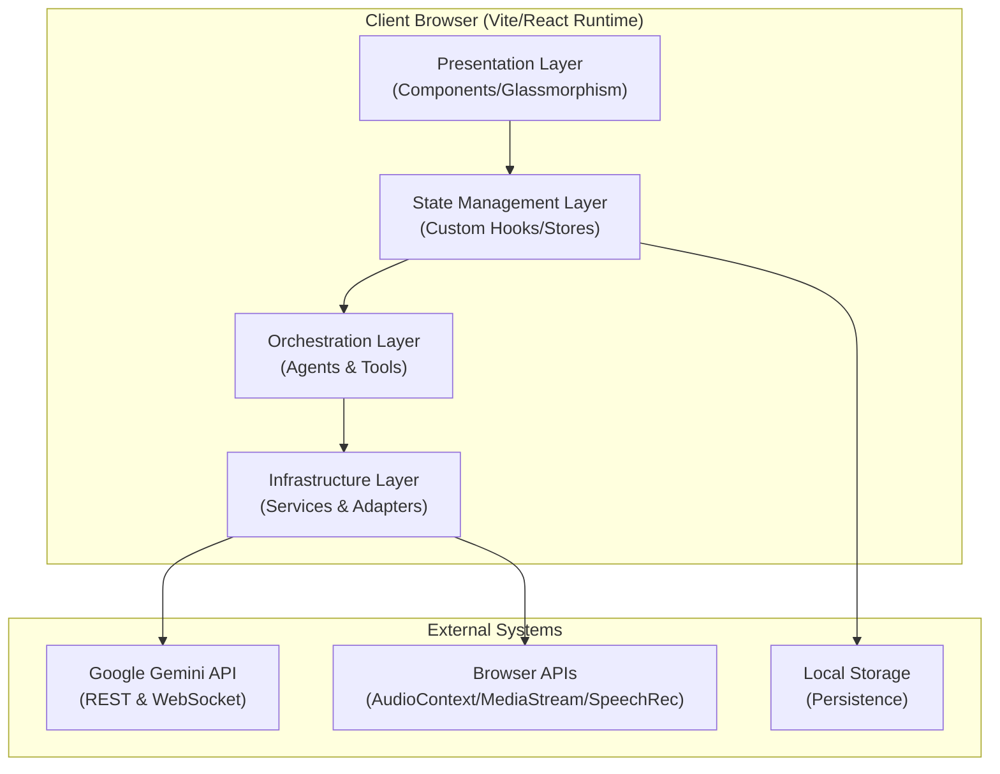
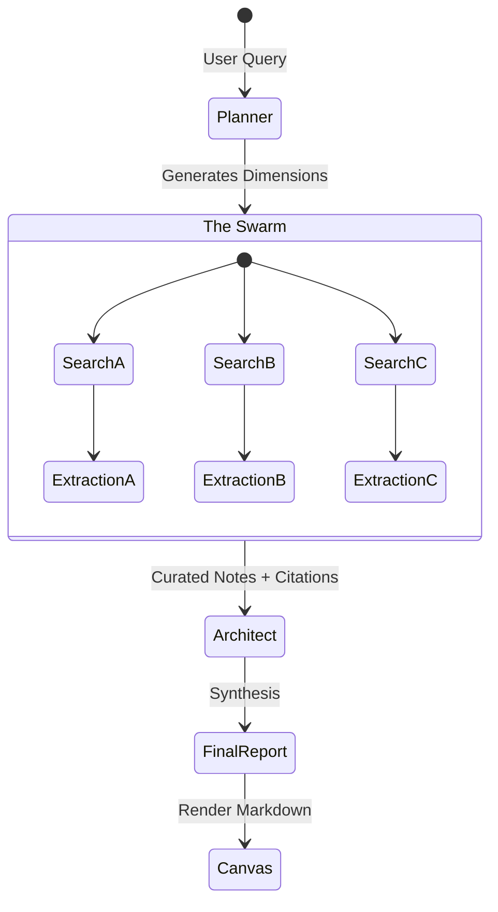
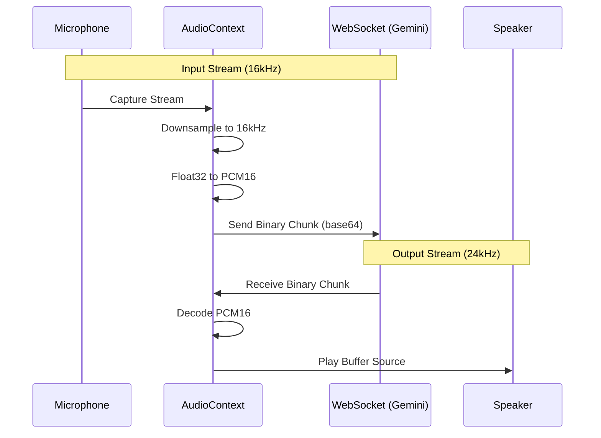

# System Architecture

## Executive Summary
The **Gemini Neural Interface** is a client-side-heavy, high-fidelity Single Page Application (SPA) designed to act as a neural bridge between user intent and Google's Multimodal Gemini models.

Unlike traditional chat interfaces, this system implements an **Agentic Orchestration Layer** directly in the browser. It manages complex state machines for "Deep Research," handles real-time bidirectional audio streaming via WebSockets, and creates generative artifacts (Canvas) dynamically. The architecture prioritizes low latency, local state persistence, and optimistic UI updates to ensure a seamless "thought-speed" interaction.

---

## High-Level System Design

The system follows a **Layered Hexagonal Architecture**, separating the User Interface, Domain Logic (Hooks), and Infrastructure (Services/SDKs).



---

## Core Subsystems

### 1. The Neural Bridge (Orchestration Layer)
Located in `src/hooks/useChatStream.ts` and `src/services/geminiService.ts`, this is the decision engine of the application.

*   **Responsibility:** It decides whether a user request requires a simple LLM inference, a complex agentic workflow (Deep Research), or a tool execution.
*   **Thinking Process Parser:** The system utilizes a custom Regex Stream Parser (`responseParser.ts`) to separate the model's `<think>` blocks (Chain of Thought) from the final response, rendering them in a collapsible "Brain Circuit" UI component in real-time.
*   **Tool Loop:** It implements a recursive execution loop:
    1.  Model requests tool ->
    2.  System executes tool (locally or via fetch) ->
    3.  System feeds result back to Model ->
    4.  Model generates final answer.

### 2. Deep Research Agent (SOTA)
The logic in `src/services/researchAgent.ts` implements a multi-step autonomous swarm architecture.



*   **Planner (Flash Model):** Decomposes the query into orthogonal search vectors.
*   **Swarm (Parallel Execution):** Executes concurrent Google Searches using the Grounding API.
*   **Filter (Cognitive Extraction):** Reads raw HTML/Snippets and extracts signal vs. noise, appending Source IDs (`[1]`).
*   **Architect (Pro Model):** Synthesizes the extracted notes into a cohesive markdown report, preserving the citation chain.

### 3. Gemini Live (Real-Time Audio Pipeline)
Located in `src/hooks/useLiveSession.ts`, this subsystem bypasses the standard HTTP request model in favor of persistent WebSockets.



*   **Audio Processing:** Utilizes the Web Audio API (`ScriptProcessorNode`) to perform client-side PCM encoding.
*   **Visual Context:** Captures frames from the User Media Video Track at 1 FPS, compresses them to base64 JPEGs, and injects them into the WebSocket stream for multimodal "sight".

### 4. Memory & Persistence
The system employs a dual-layer memory architecture managed in `src/hooks/useChatMemory.ts`.

*   **Semantic Memory (Long-term):**
    *   A background process analyzes conversation turns.
    *   It extracts persistent facts (e.g., "User is a React Developer").
    *   Stored in `localStorage` and injected into the System Instruction of every new chat.
*   **Episodic Memory (Short-term):**
    *   When context windows approach limits, the system triggers a summarization model.
    *   Old messages are compressed into a narrative summary, preserving the "gist" while freeing up token space.

---

## Directory Structure Strategy

The codebase is organized by **Feature Domain** rather than strict technical role, promoting modularity.

```bash
src/
├── components/         # Pure UI Components (Presentation)
│   ├── layout/         # Structural (Sidebar, Workspace)
│   ├── visualizations/ # D3/SVG Charts, Research Views
│   └── ...
├── hooks/              # Business Logic & State Machines
│   ├── useChat.ts      # Main Controller
│   ├── useLive.ts      # WebSocket Controller
│   └── ...
├── services/           # External Interactions (Infrastructure)
│   ├── toolRegistry.ts # Schema Definitions
│   ├── apiClient.ts    # Google SDK Wrapper
│   └── ...
└── types/              # Domain Models (Strict TypeScript)
```

## Data Flow: The Chat Lifecycle

1.  **Input:** User types in `Composer.tsx`.
2.  **Dispatch:** `useChat.ts` optimistically updates the UI state (adds User Message).
3.  **Context Construction:** `geminiService.ts` builds the prompt, injecting:
    *   System Persona
    *   User Facts (Semantic Memory)
    *   Relevant History (Episodic Memory)
    *   Active Canvas Content
4.  **Inference:** Request sent via `GoogleGenAI` SDK.
5.  **Stream Parsing:**
    *   Chunks arrive.
    *   `responseParser.ts` splits `<think>` vs `text`.
    *   `useChatStream` updates state.
6.  **Tool Trigger (Optional):**
    *   Model returns `functionCall`.
    *   `toolRegistry` executes logic.
    *   Result fed back to Model.
7.  **Final Render:** Markdown rendered via `react-markdown` with custom components for CodeBlocks, Charts, and Citations.

## Tech Stack & Decisions

| Technology | Role | Justification |
| :--- | :--- | :--- |
| **Vite** | Build Tool | Instant HMR and ESModule support for rapid prototyping. |
| **React 19** | View Layer | Leveraging new Hooks patterns and transition stability. |
| **Google GenAI SDK** | AI Interface | Native support for Multimodal inputs and Live API. |
| **Tailwind CSS** | Styling | Utility-first approach for rapid glassmorphism implementation. |
| **LocalStorage** | Database | Zero-backend deployment; total user privacy (data lives on device). |
